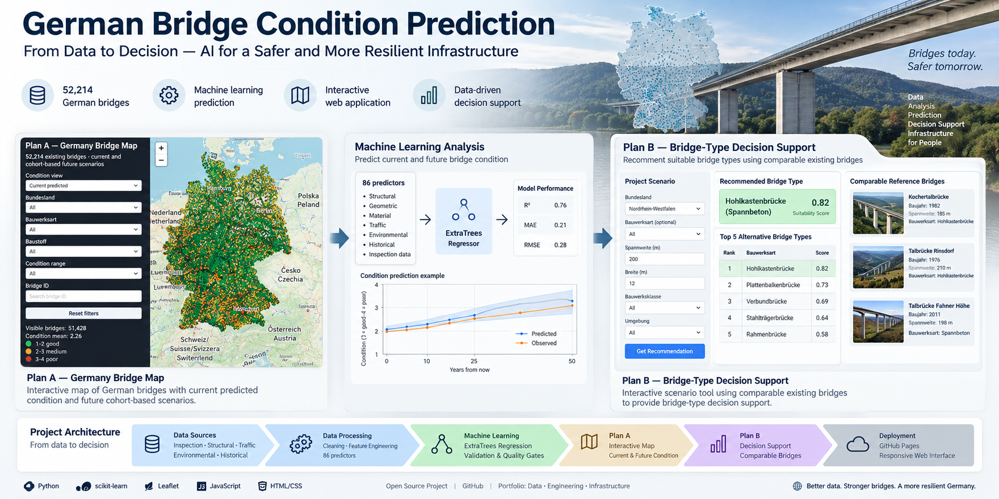

# German Bridge ML Project



## Data-driven bridge condition prediction and decision support for Germany

An end-to-end machine learning and web deployment project for analysing the condition of German bridges and supporting bridge-type decisions from comparable existing structures.

**52,214 bridges · 86 ML predictors · ExtraTrees regression · Interactive Plan A & Plan B**

---
# German Bridge ML Project

## Data-driven bridge condition prediction and decision support for Germany

An end-to-end machine learning and web deployment project ...

52,214 bridges · 86 ML predictors · ExtraTrees regression · Interactive Plan A & Plan B


## Engineering Context

This project combines civil and bridge engineering with data analytics. It integrates bridge inspection, structural, traffic and environmental data to analyse the condition of German bridges and explore data-driven decision support.

The project demonstrates how Python, SQL and machine learning can complement engineering workflows. It is intended as an analytical and decision-support tool and does not replace structural calculations, design, code verification or professional engineering judgement.

---
## Live Demo

### Plan A — Germany Bridge Condition Map
...
## Live Demo

### Plan A — Germany Bridge Condition Map

**[Open Plan A](https://kourosh-kosari.github.io/german-bridge-condition-prediction/plan-a/)**

Interactive Germany-wide bridge map with current predicted condition and cohort-based future scenarios.

### Plan B — Bridge-Type Decision Support

**[Open Plan B](https://kourosh-kosari.github.io/german-bridge-condition-prediction/plan-b/)**

Interactive scenario interface that compares a proposed bridge with geographically and technically comparable existing bridges and produces bridge-type decision support.

---

## Project Story

The project combines civil/structural engineering knowledge with data engineering, machine learning and web-based decision support.

The workflow is:

```text
Bridge Data
    ↓
Data Engineering & Feature Construction
    ↓
Final Bridge-Level Dataset
    ↓
86-Predictor ML Contract
    ↓
Frozen ExtraTrees Model
    ↓
┌───────────────────────────────┐
│                               │
▼                               ▼
Plan A                          Plan B
Current / future                Reference-based
bridge condition                bridge-type
analysis                         decision support
│                               │
└───────────────┬───────────────┘
                ↓
        Interactive Web Apps
                ↓
          GitHub Pages
```

---

## Plan A — Germany Bridge Condition

Plan A provides an interactive map of the German bridge population.

It supports:

- current predicted bridge condition
- observed condition as reference information
- cohort-based future condition scenarios
- +10, +25 and +50 year horizons
- filtering by Bundesland
- filtering by Bauwerksart
- filtering by Baustoff
- condition-range filtering
- bridge-ID search
- bridge-level information on map selection

The future layer is a **cohort age-conditioned scenario layer**. It is not presented as a validated individual longitudinal deterioration forecast. Uncertainty and extrapolation status are retained in the outputs.

---

## Plan B — Bridge-Type Decision Support

Plan B is designed for a proposed/new bridge scenario.

The user can enter parameters such as:

- latitude
- longitude
- bridge length
- bridge width
- optional DTV
- optional Baustoff

The system then:

1. identifies comparable existing bridges
2. calculates parameter/geographic similarity
3. forms an evidence cohort
4. evaluates bridge-type performance evidence
5. combines similarity and performance into a transparent decision score
6. presents ranked Bauwerksarten
7. shows supporting reference bridges

The decision-support layer is reference-based. The **Bauwerksart is the target, not an input**.

Plan B is not structural design, FEM analysis, dimensioning, code checking or formal engineering approval.

---

## Machine Learning

The condition model is an **ExtraTreesRegressor** using a frozen 86-predictor feature contract.

### Independent test performance

| Metric | Result |
|---|---:|
| MAE | 0.248871 |
| RMSE | 0.332170 |
| R² | 0.452683 |

These are the frozen independent-test results and are distinct from retrospective full-population scoring.

### Dataset

- Bridge population: **52,214**
- Final predictor count: **86**
- Target: `zustandsnote`
- Bridge-level grain: one row per `bridge_id`
- Frozen model: ExtraTrees regression

The frozen model is not retrained or changed by the Plan A / Plan B deployment layer.

---

## Validation & Quality Gates

The project includes dedicated validation and integration stages:

- Plan A current-condition validation
- future-condition output checks
- Germany map validation
- Plan B reference-library validation
- independent Plan B validation
- user-scenario validation
- final project integration audit
- frozen-model integrity check
- output inventory

The final integration checks confirm consistent bridge populations across the main Plan A / Plan B outputs and preserve the documented architecture boundaries.

---

## Technology Stack

**Engineering / Data**

- Python
- Pandas
- NumPy
- PostgreSQL
- SQL
- Parquet / CSV

**Machine Learning**

- scikit-learn
- ExtraTreesRegressor
- feature engineering
- validation and reproducibility controls

**Infrastructure Data**

- bridge inspection / structural attributes
- traffic data
- weather data
- geographic matching

**Web**

- HTML
- CSS
- JavaScript
- Leaflet
- OpenStreetMap
- GitHub Pages

---

## Repository Structure

```text
german-bridge-condition-prediction/
│
├── README.md
├── .nojekyll
├── 23_GitHub_Web_Deployment_Package.ipynb
├── deployment_inventory.json
│
├── plan-a/
│   ├── index.html
│   └── data/
│       └── plan_a_bridge_data.json
│
├── plan-b/
│   ├── index.html
│   └── data/
│       └── plan_b_reference_library.json
│
└── notebooks/
    ├── 01_BAST_GIS.ipynb
    ├── 02_Traffic_Features.ipynb
    ├── 03_Weather_Features.ipynb
    ├── 04_Integrated_Dataset.ipynb
    ├── 05_Dataset_Imputation.ipynb
    ├── 06_Load_Final_Bridge_Dataset_to_PostgreSQL.ipynb
    ├── 07_ML_Condition_Model_Validation.ipynb
    ├── 08_Bridge_Type_Decision_Engine_Independent_Validation.ipynb
    ├── 09_ML_Bridge_Type_Selection_Explainability_Robustness.ipynb
    ├── 10_Bridge_Type_Engineering_Decision_Report.ipynb
    ├── 11_Pipeline_Audit_and_Reproducibility.ipynb
    ├── 12_ML_Model_Freeze_and_Packaging.ipynb
    ├── 13_End_to_End_Inference_and_Production.ipynb
    ├── 14_Bridge_Map_Builder.ipynb
    ├── 15_Plan_A_Current_Bridge_Condition.ipynb
    ├── 16_Plan_A_Future_Condition.ipynb
    ├── 17_Plan_A_Germany_Web_Map.ipynb
    ├── 18_Plan_B_Reference_Library_and_Decision_Engine.ipynb
    ├── 19_Plan_B_Independent_Validation_and_Decision_Engine.ipynb
    ├── 20_Plan_B_User_Scenario_Recommendation_Engine.ipynb
    ├── 21_Plan_B_Final_Interactive_Interface.ipynb
    └── 22_Final_Project_Integration_and_PreDeployment_Gate.ipynb
```

The notebook list above describes the intended portfolio organization. The deployed web application is separated from the analysis notebooks so that GitHub Pages can serve the application as a static site.

---

## Project Architecture

```text
                    DATA SOURCES
                         │
                         ▼
              DATA ENGINEERING PIPELINE
                  01 → 02 → 03
                         │
                         ▼
                04 INTEGRATED DATASET
                         │
                         ▼
                 05 DATA IMPUTATION
                         │
                         ▼
              06 FINAL BRIDGE DATASET
                         │
              ┌──────────┴──────────┐
              ▼                     ▼
     MACHINE LEARNING         DECISION SUPPORT
        PIPELINE                   PIPELINE
              │                     │
      07 Model Validation     18 Reference Library
              │                     │
      11 Pipeline Audit       19 Independent Validation
              │                     │
      12 Model Freeze         20 User Scenario
              │                     │
      13 Production           21 Interactive UI
         Inference                   │
              │                      │
              ▼                      ▼
       FROZEN CONDITION        DECISION ENGINE
            MODEL                    ▲
              │                      │
              ├───────┐              │
              ▼       ▼              │
           PLAN A   CONDITION ───────┘
              │      EVIDENCE
        ┌─────┴─────┐
        ▼           ▼
     Current      Future
    Condition    Scenarios
        │
        ▼
   17 Germany Web Map

                 PLAN B
        Reference + Similarity
        + Condition Evidence
                 │
                 ▼
        Bridge-Type Selection

The ML condition model and the Plan B reference-based decision layer are separate components, while condition predictions may be used as evidence within the Plan B decision process.

```
# Engineering Boundary

This project is a **data-driven decision-support system**.

It does not replace:

- structural design
- FEM modelling
- structural dimensioning
- code checking
- engineering calculations
- formal approval
- expert engineering judgement

The outputs should therefore be interpreted as analytical evidence and decision support rather than as construction-ready structural design.

---

# Reproducibility

The project maintains explicit feature contracts, model integrity checks, validation gates and deployment inventories.

The frozen model is treated as an immutable artifact during Plan A and Plan B development.

---

# Author / Portfolio Focus

**Kourosh Kosari**

Civil / Structural Engineering · Bridge Engineering · Data Analysis · Machine Learning

This project demonstrates the combination of structural engineering knowledge with data engineering, machine learning and infrastructure data analysis.

```text
